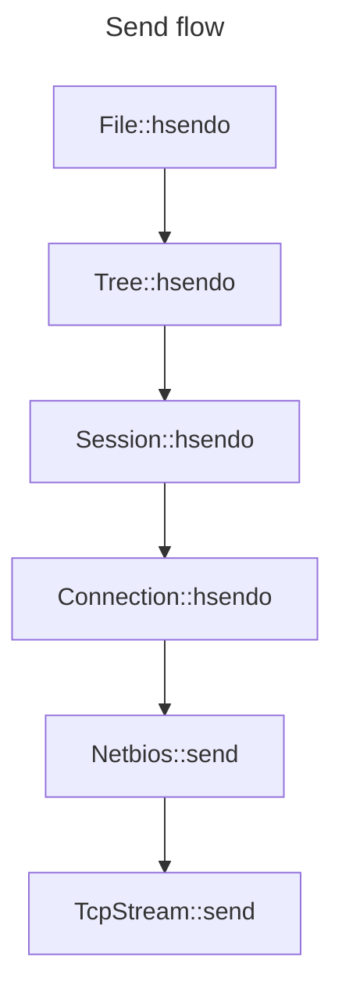
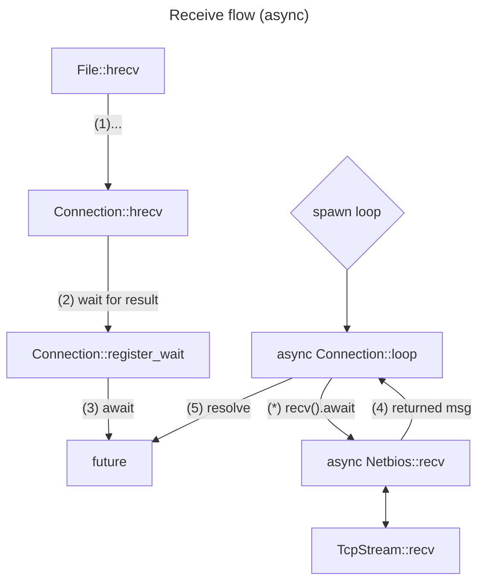

# SMB Lib
The send message flow on the sync and async case should be quite similar, because send is processsed immediately. The major different is that send is async in the TcpStream at the end of the chain, but the sequence is the same.

Looking at the receive flow, the sync case should be similar to the send flow, because we are blocking until receive is done, and when the receive is done, we return the result and it is processed in the chain. The "push" of the receive is by the client, because it is blocking.

Examining the async case tells a different story. Using async should result in better performance, and should allow to send another request while the previous one is still being processed after receiving, resulting in a major latency decrement. It is also useful for some notify messages, that are first requested when the client wants to start listening for them, but can't tell when they will arrive.
