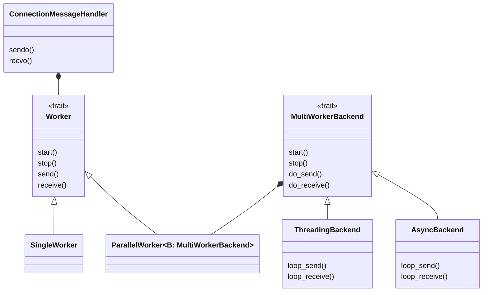

# Connection Core Module
First, let's define some terms:
- "multi" refers to ANY threading model that might contain more than one thread or task - it could be async or multi-threaded.
- "single" refers to a single-threaded model.
- "async" is the async/await model.
- "multi-threaded" is the traditional multi-threaded model, with `std::thread` or similar.
## Design overview
1. The most basic unit is the `Worker` trait, which defines the basic operations of a worker, such as `start`, `stop`, `send`, `receive`.
2. The `SingleWorker` is a simple implementation of `Worker` trait, which is single-threaded.
3. The `ParallelWorker` is a more complex implementation of `Worker` trait, which is multi-threaded.
   1. The `ParallelWorker` uses a `MultiWorkerBackend` trait to define the backend operations.
   2. Since much of the common logic is shared between different backends (for example, waiting for a message to be received), the `MultiWorkerBackend` trait is used to define the common operations.
   3. The `ThreadingBackend` and `AsyncBackend` are two implementations of `MultiWorkerBackend` trait, which are multi-threaded and async respectively.
4. The `ConnectionMessageHandler` is the high-level logic that uses the `Worker` trait to send and receive messages.

This is a general overview of the design, the actual implementation is slightly different, but the basic idea is the same. Visit the module's source code for more details.
