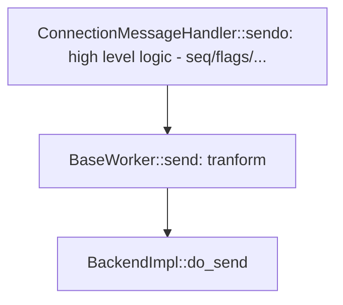
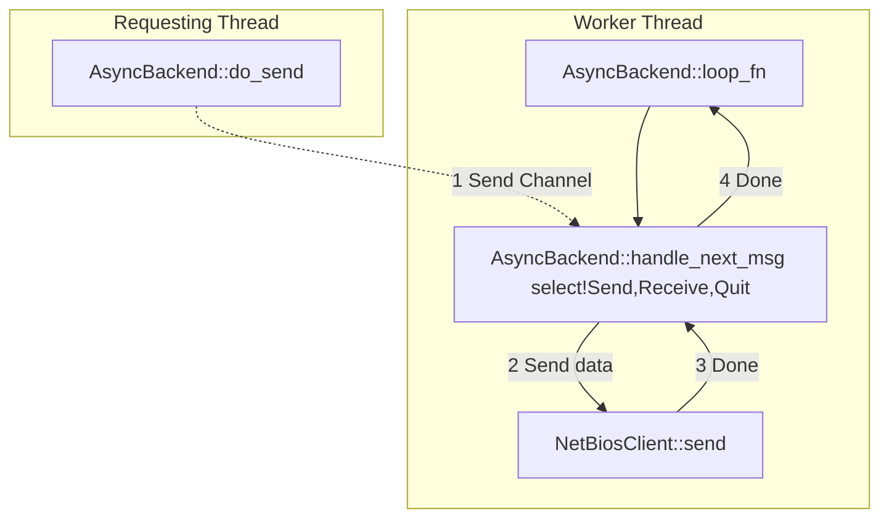
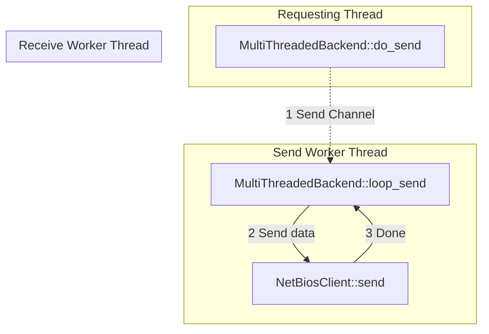
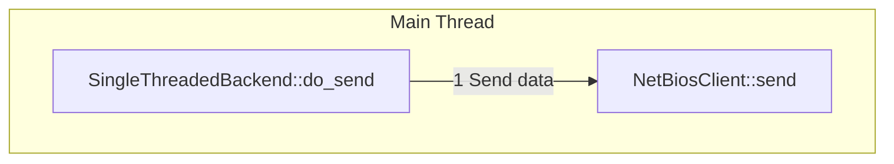

## Send Flow
In all cases, the flow of sending a message is client-initiated in 100%, so there's not so much room for customizing per-backend, and the data flow is quite understandable.

Generally:

For async backend:

For multi-threaded backend:

For single-threaded backend:
